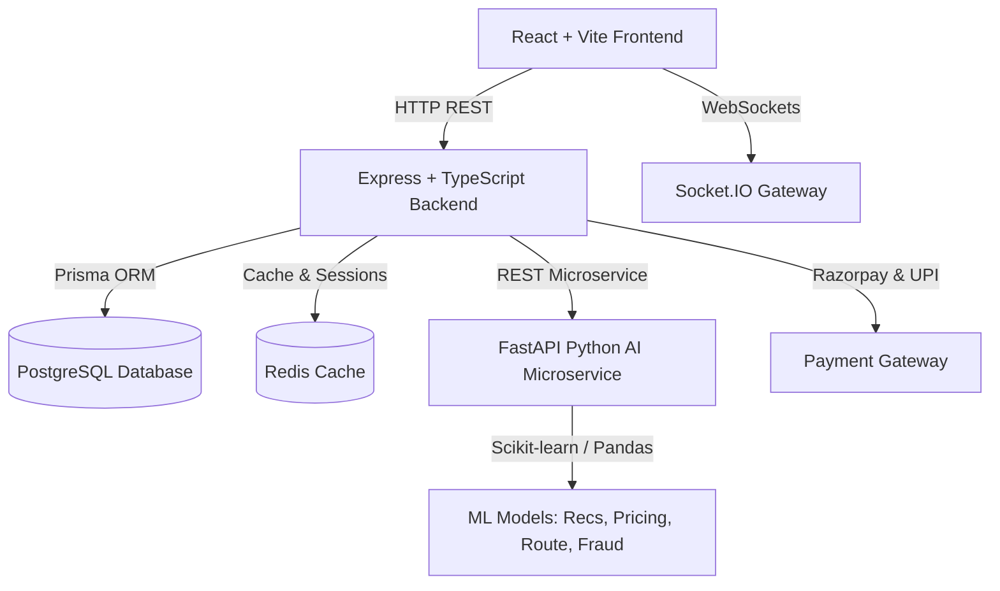

# ⚡ VoltConnect AI (ChargeMitra)

> **India's AI-Powered EV Mobility Super App & Peer-to-Peer Charger Sharing Network**

[](https://github.com/Aashishrishu02/VoltConnect-AI/actions)
[](https://opensource.org/licenses/MIT)
[](https://nodejs.org/)
[](https://react.dev/)
[](https://www.typescriptlang.org/)
[](https://www.postgresql.org/)

**VoltConnect AI (ChargeMitra)** ("Airbnb for EV Chargers") is a production-ready, peer-to-peer EV charger sharing marketplace and mobility super app built specifically for the Indian market. It enables private EV charger owners (hosts) to list their home, apartment, office, hotel, or commercial chargers to earn passive income, while providing EV drivers with real-time station discovery, MCDA battery-aware smart recommendations, AI highway route planning, emergency roadside assistance, and green rewards.

---

## 🌟 Key Features

### 🧠 Smart AI Engine & Microservices
- **Multi-Criteria Decision Analysis (MCDA) Recommender**: Ranks chargers by combining battery SOC %, vehicle compatibility, charging speed (kW), pricing index (₹), driver trust ratings, and live traffic.
- **VoltConnect AI Assistant**: Natural language conversational helper for highway trip planning, charging cost estimates in ₹, and vehicle plug compatibility (CCS2, Type 2, GB/T, Bharat AC/DC).
- **EV Highway Route Planner**: Calculates optimal charging sequences, charging durations, and arrival SOC % along long-distance Indian highway journeys (e.g. Delhi to Jaipur, Bengaluru to Mysuru).
- **Dynamic Surge Pricing Engine**: Real-time pricing model suggesting optimal rates to hosts based on grid demand and occupancy.

### 🚘 Driver Features
- **Interactive Map & Filter System**: Leaflet map centered on India with markers color-coded by charging speed and live availability.
- **Search & Filters**: Filter by city, connector plug (CCS2, Type 2 Mennekes, Bharat AC001/DC001, CHAdeMO, GB/T), power output (3.3kW to 150kW), price, and amenities.
- **Virtual Queue System**: Socket.IO powered virtual waiting queue with estimated wait time tracking when stations are occupied.
- **Emergency SOS & Highway Assistance**: One-tap 24/7 roadside assistance dispatch for flatbed towing, mobile battery charger boost, tyre mechanics, and local host emergency charging.
- **Green Rewards & Carbon Tracker**: Earn Green Points for charging/hosting, redeem coupon discounts, and track CO₂ saved (kg) and tree equivalents (🌳).

### 🔌 Host Charger Owner Features
- **10-Step Charger Registration Wizard**: Detailed host onboarding covering property type, address, GPS pin capture with Nominatim reverse-geocoding, charger specs, pricing, availability, photos, and UPI/bank payout info.
- **Host Dashboard & Earnings**: Visual analytics for weekly earnings, occupancy, active charging sessions, and charger health reminders.

### 🛡️ Sole Platform Admin Governance & Audit Logging
- **Strict `PENDING` Isolation**: Every newly registered host charger defaults to `PENDING` status and is **strictly hidden** from public map search until approved.
- **5 Admin Governance Actions**: `Approve`, `Reject` (with reason prompt), `Request Information`, `Suspend`, and `Delete`.
- **Immutable Audit Logging**: Every admin action generates an `AdminLog` record (`adminId`, `action`, `targetResource`, `timestamp`, `details`).
- **Platform Analytics**: Gross platform revenue (₹), platform fee earnings, pending queue, user trust scores, and active bookings.

---

## 📐 System Architecture



---

## 🗄️ Database Entity-Relationship (ER) Diagram

```mermaid
erDiagram
    USER ||--o{ CHARGER : "hosts"
    USER ||--o{ BOOKING : "places"
    USER ||--o{ REVIEW : "writes"
    USER ||--o1 WALLET : "owns"
    USER ||--o{ ADMINLOG : "logs"
    CHARGER ||--o{ BOOKING : "receives"
    CHARGER ||--o{ AVAILABILITY_SLOT : "has"
    CHARGER ||--o{ VIRTUALQUEUE : "queues"
    BOOKING ||--o1 PAYMENT : "has"
    BOOKING ||--o1 REVIEW : "has"
    WALLET ||--o{ TRANSACTION : "contains"

    USER {
        string id PK
        string email
        string roles "DRIVER | OWNER | ADMIN"
        float rating
        int trustScore
        int greenPoints
    }

    CHARGER {
        string id PK
        string title
        string status "PENDING | APPROVED | REJECTED | NEEDS_INFORMATION | SUSPENDED"
        string liveStatus "AVAILABLE | CHARGING | RESERVED | OFFLINE"
        float pricePerHour
        float powerKw
        string connectorType
    }

    ADMINLOG {
        string id PK
        string adminId FK
        string action
        string targetResource
        datetime createdAt
    }
```

---

## 🚀 Quickstart with Docker Compose

Ensure Docker Desktop is installed and running on your machine:

```bash
# 1. Clone the repository
git clone https://github.com/Aashishrishu02/VoltConnect-AI.git
cd VoltConnect-AI

# 2. Build and start all services
docker-compose up --build
```

Access the application in your browser:
- **Frontend Super App**: `http://localhost:3000`
- **Backend Express API**: `http://localhost:5000/api/v1`
- **AI Microservice**: `http://localhost:8000/docs`

---

## 🧪 Seed Data & Pre-Funded Accounts

The database automatically seeds with Indian EV chargers, hosts, and pre-funded wallets:

| Account | Email | Password | Role | Wallet Balance |
| :--- | :--- | :--- | :--- | :--- |
| **Sole Platform Admin** | `admin@chargeshare.in` | `admin123` | `DRIVER, OWNER, ADMIN` | **₹50,000** |
| **Host 1 (Rajesh Sharma)** | `host.rajesh@chargeshare.in` | `host123` | `DRIVER, OWNER` | **₹8,080** |
| **Host 2 (Priya Nair)** | `host.priya@chargeshare.in` | `host123` | `DRIVER, OWNER` | **₹14,500** |

---

## 📜 License
Licensed under the [MIT License](LICENSE).
